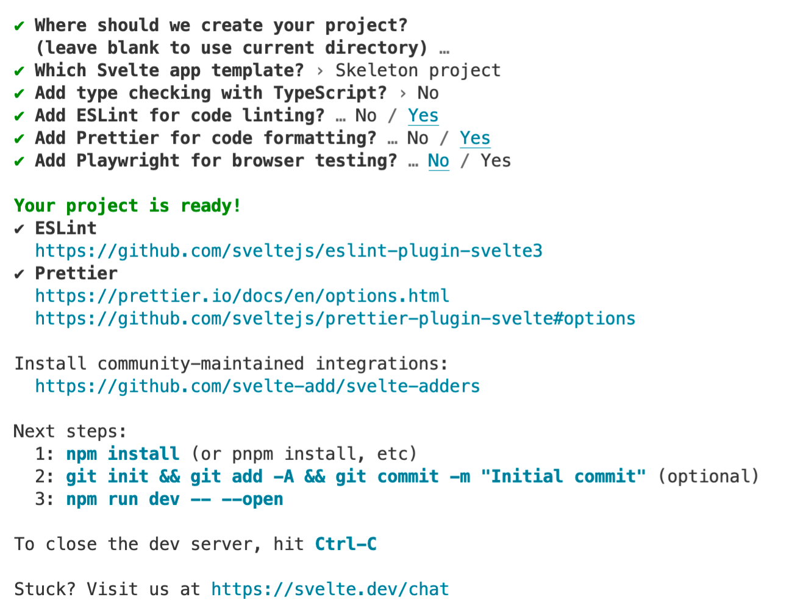

# JavaScript Framework Starters

- A presentation with Hispanic Hackers Tech Group
- Setting up basic structures for major JavaScript libraries/frameworks
- Focused on React, Nextjs, and Sveltekit

- Speakers: James Lockwood, [Timothy Hoang](https://www.timothyhoang.dev/)

---

## Nextjs Starter Guide with Timothy Hoang

#### Recommended Links & Extensions

- [Next.js Home](https://nextjs.org/)
- [PNG to ICO Converter](https://www.freeconvert.com/png-to-ico)
- [Hispanic Hackers Website](https://github.com/timOTdev/hispanic_hacker_next)
- [Tim's Portfolio Website](https://github.com/timOTdev/thDev3)

#### Setup

- [Next.js File Structure](https://nextjs.org/docs/getting-started)
- Navigate to target directory
- Run `npx create-next-app@latest`
  - `npx create-next-app@latest --typescript` for typescript
  
#### Dependencies

- `cd <YOUR_FOLDER_NAME>`
- `npm install` or `yarn`
- `yarn dev` to start server

> Use `nextjs_steps` folder for each step as guidance

#### 1. Favicon

- `public` - Stores static assets such as images, fonts, etc.
- `/public/favicon.ico`
- Files inside public directory can then be referenced with the base URL (/)
- You need to re-run `yarn dev`
- I also had to use brave, chrome didn't show the icon for some reason
- Hit refresh on browser

#### 2. Add Title

- `/pages/index.js`
- Update the title

#### 3. Linting and Code Formatting

- Running `yarn lint` will prompt you to configure ESLint
- Choose `Strict`

- Also have to set up prettier
- First, run `yarn add --dev prettier eslint-config-prettier eslint-plugin-prettier`

- [eslint-config-prettier](https://github.com/prettier/eslint-config-prettier)
- `eslint-config-prettier` package turns off all rules for eslint that are unnecessary or might conflict with Prettier.

> *eslint-plugin-prettier does not install Prettier or ESLint for you. You must install these yourself.*

- Second, add `.prettierrc.js` with code from

```js
module.exports = {
  semi: false,
  singleQuote: true,
  trailingComma: 'none',
}
```

- Last, add configuration in `.eslintrc.json`

```json
{
  "extends": ["next", "plugin:prettier/recommended"]
}
```

- Purposefully add this variable to `pages/index.js` and remove a closing tag on any element

```js
 const myObj = {
   name: 'HispanicHacker"'
 }
```

- Run `yarn lint` and it shows you errors 1 at a time.

#### 4. Global Styles

- I will skip this because of trend change.
- It looks like [Styled-components](https://nextjs.org/blog/next-12-1) was supported unofficially since 12.1.
- [Article noting the change](https://www.reddit.com/r/nextjs/comments/svvvew/styledcomponents_with_nextjs_12/)
- I use to use `createGlobalStyles` but it looks like there's no mention in the docs and it was no longer mentioned to favor styled-components.

#### 5. Layout

- [Layouts Docs](https://nextjs.org/docs/basic-features/layouts)
- We're using Per-Page Layouts here.
- Basically wrapping each component with our Layout component as needed.
- The technique used is also new to me.
- See the documentation link.

#### 6. Routing

- [Routing Docs](https://nextjs.org/docs/routing/introduction)
- Nothing new here as it's the same as Sveltekit
- Instead of Svelte's `routes` folder, Next.js uses `pages` folder
- You can also dynamically create paths with square brackets the same way in Svelte and Next.js

#### 7. Static Data Store

- You can customize this structure as you see fit.
- Having a central file to render text makes editing a small app much easier.
- It helps keeps all your links unified as well and can be used in the same file.
- See my linked apps to see how I did my data structures.
- I generally use a `lib` or `asset` folder with a `data.js` file.
- Then exporting the exposed data into a component and looping with rendering.

#### 8. Data Fetching

- [getStaticProps Docs](https://nextjs.org/docs/basic-features/data-fetching/get-static-props)
- [getServerSideProps Docs](https://nextjs.org/docs/basic-features/data-fetching/get-server-side-props)

- `getStaticProps` and `getServerSideProps` are Next.js methods of pulling data.
- The former pulls data during build time (SSG) and the latter pulls during run time/request time (SSR).
- We're looking at `getStaticProps` today.
- Helps pre-render our HTML pages at build time making it great for SEO and fast page loading.
- Use when you have a lot of static data, data from a CMS that doesn't change often.

---

## Sveltekit Starter Guide with Timothy Hoang

#### Recommended Links & Extensions
- [Sveltekit Docs](https://kit.svelte.dev/docs/introduction)
- [Svelte realworld](https://github.com/sveltejs/realworld)
- [Svelte Society](https://sveltesociety.dev/)
- [User Examples](https://github.com/topics/sveltekit)
- [User Templates](https://github.com/topics/sveltekit-template)
- [Tim's Barber Site](https://github.com/timOTdev/dbcom2)

- [Svelte for VS Code](https://marketplace.visualstudio.com/items?itemName=svelte.svelte-vscode)
- [Git Graph](https://marketplace.visualstudio.com/items?itemName=mhutchie.git-graph)
- [GitLens — Git supercharged](https://marketplace.visualstudio.com/items?itemName=eamodio.gitlens)
- [Diff Tool](https://marketplace.visualstudio.com/items?itemName=jinsihou.diff-tool)

#### Setup

- Navigate to target directory
- Run `npm create svelte@latest .`
- For create-svelte@latest dependency: `y` + enter to proceed
- Choose `Skeleton project` and push enter
- [Svelte's file structure](https://kit.svelte.dev/docs/project-structure)
- 

- *Dependencies*
- `cd <YOUR_FOLDER_NAME>`
- `npm install` or `yarn`
- `yarn dev` to start server

#### 1. Favicon

- `/static/favicon.png`
- Hit refresh on browser

#### 2. Add Title

- `/src/routes/index.svelte`

```js
<svelte:head>
    <title>My Awesome Sveltekit</title>
</svelte:head>
```

#### 3. Linting and Code Formatting

- Check out `package.json`: notice `yarn lint` and `yarn format`
- Checkout `.prettierrc`: notice `singleQuote` and `trailingComma`
- Add this to index.svelte:

```js
<script>
   const myObj = {
       name: "HispanicHacker",
   }
</script>

<h1>Welcome, {myObj.name}!</h1>
```

- `yarn lint` tells you the files with issues
- `yarn format` to auto-fixes errors, lists changed files in white
- Alternatively, go to the file Format Document (or Format Document with...Svelte for VS Code as default)

#### 4. Global Styles

- Add `src/style/global.css`
- Import into index.svelte script tagwith `import '../styles/global.css';`
- Component styles override global.css styles
- Tip: `font-size: 62.5%;` is awesome.
- Tip: Work form mobile view smallest to biggest. AKA 320px then upwards.

#### 5. Layout

- [Layout Docs](https://kit.svelte.dev/docs/layouts)
- `<slot /> is the stub for any components being passed in`
- AKA `children` in React essentially
- Add `src/routes/__layout.svelte` (sveltekit_samplers)
- Add `src/routes/components/Header.svelte`
- Add `src/routes/components/Footer.svelte`

#### 6. Routing

- [Routing Docs](https://kit.svelte.dev/docs/routing#pages)
- Add `src/routes/about.svelte` (sveltekit_samplers)
- Add title to svelte head
- Notice the layout applies on top of the path
- Notice that casing of the file matters. IE `/about` vs `/About`

#### 7. Static Data Store

- [Each Syntax](https://svelte.dev/tutorial/keyed-each-blocks)
- Add `lib/data.js`
- Reference in `about.js`
- Use `{#each}` to iterate over data
- Now split the Business and the Hairstyles Components
- Tip: use `main`, `section`, `div` accordingly
- Tip: use section id to tag for file movement

#### 8. Data Fetching

- [Loading Docs](https://kit.svelte.dev/docs/loading)
- [Context Module Script](https://svelte.dev/tutorial/sharing-code)
- Only applies to Page and layout components
- Runs once before component is created and page is rendered
- Runs during server-side rendering and in the client
- Similar to `getStaticProps` or `getServerSideProps` in Next.js

- Svelte's `fetch` is the native web API augmented with [extra features](https://kit.svelte.dev/docs/loading#input-fetch)
- We're pulling data from [external API](https://jsonplaceholder.typicode.com/posts)
- `<script context="module">` is called before the component loads, separate from regular `<script>` in svelte file
- You also need to export it since it's set as props on the component
